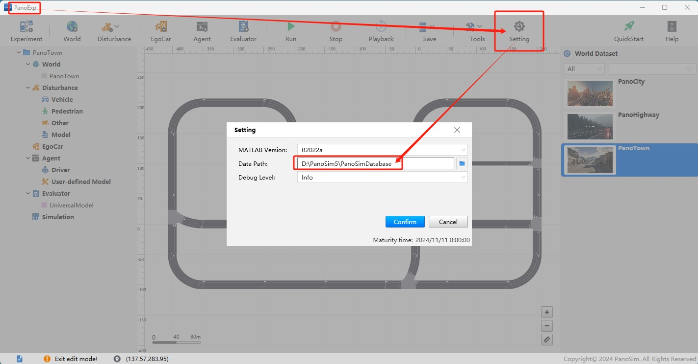

[PanoSim](https://www.panosim.com/) V33 began to provide support for [ASAM](https://www.asam.net/) - [OpenScenario 2.0](https://publications.pages.asam.net/standards/ASAM_OpenSCENARIO/ASAM_OpenSCENARIO_DSL/latest/index.html). Here are some examples to show how to run scenario files (osc) in PanoSim.


## Installation

Follow these steps to set up the run environment and install the package:

### 1. downloand [files](./PanoSimDatabase)

### 2. find local folder


### 3. copy files to local folder

### 4. restart PanoExp

### 5. instal python package

1) start command prompt(cmd.exe)

2) enter Scripts folde
    ```
    cd {PanoSim install folder}\Bin\py36\Scripts
    ```

3) run follow command
    ```
    pip install -v xmlschema==1.0.18
    pip install -v py_trees==0.8.3
    pip install -v ephem==4.1.5
    pip install -v networkx==2.2
    pip install tabulate
    pip install antlr4-python3-runtime==4.10
    ```

## Run


## Special Thanks

- **CARLA Simulator**: [CARLA Simulator GitHub](https://github.com/carla-simulator/carla)

- **ScenarioRunner for CARLA**: [ScenarioRunner for CARLA GitHub](https://github.com/carla-simulator/scenario_runner)

## License

The software is double-licensed under the MIT license, with copyright by 3blue1brown LLC (see LICENSE), and copyright by Manim Community Developers (see LICENSE.community).
